# Hardware Documentatie
___
De RemoteLabs oplossing bestaat uit twee hardware systemen die samen of onafhankelijk 
van elkaar kunnen werken. Deze systemen hebben een bepaalde modulariteit. Waardoor 
verschillende labo’s ontworpen kunnen worden. 

## Smart Tiles
Het Smart Tile systeem bestaat uit twee verschillende tegels de Central Tile en de 
Expansion Tile. In het systeem zit er eenmaal een Central Tile en verschillende 
Expansion Tiles. De opbouw van beide type tegels zijn grotendeels identiek. Het enige 
verschil tussen de twee tegels is dat de Central Tile verbonden wordt met de voeding. 

De Smart Tile is een houten doos met vinger verbindingen. Deze doos zal gemaakt 
worden met behulp van een lasercutter. 

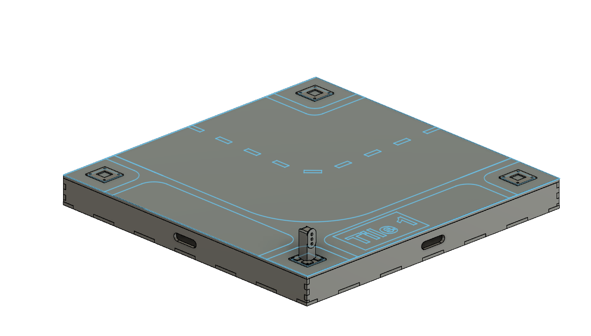

#### afmetingen

> Smart Tile Onderkant 

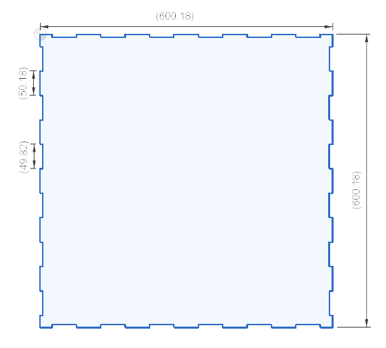

> Smart Tile voor & achterzijde 

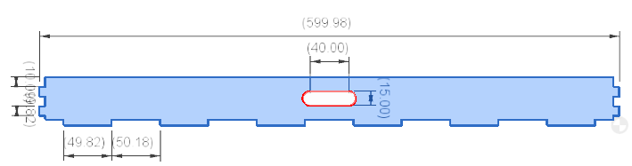

> Smart Tile Linker & Rechterzijde 

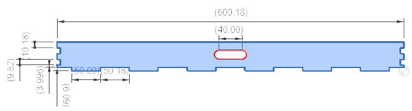

De bovenzijde van de Smart Tile is een houten plaat waarop een wegdek in gegraveerd 
wordt. De top zal in plaat gehouden door houten latten die tussen de basis van de 
tegel. 

> Smart Tile Top onderkant 

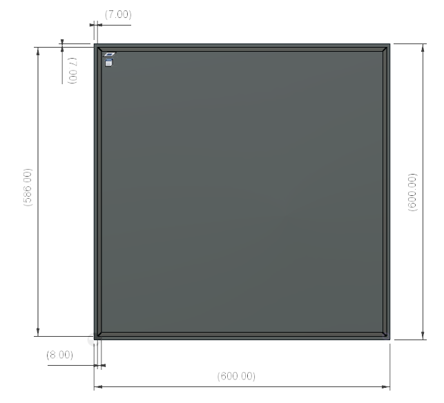

Op dit moment bestaat het systeem uit verschillende graveringen die samengesteld 
worden. In de toekomst kunnen er altijd graveringen worden toegevoegd om andere 
configuraties op te bouwen.

> Smart Tile bovenaanzicht 1

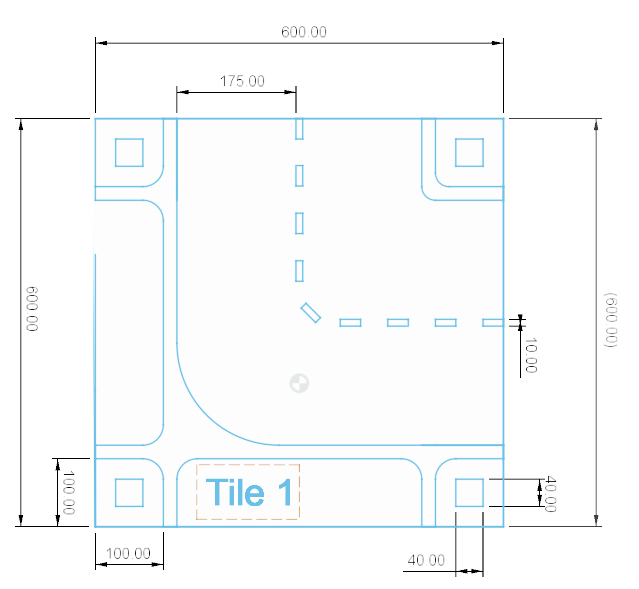

> Smart Tile bovenaanzicht 2

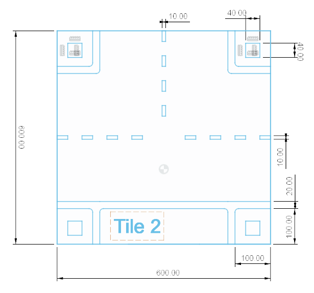

> Smart Tile bovenaanzicht 3

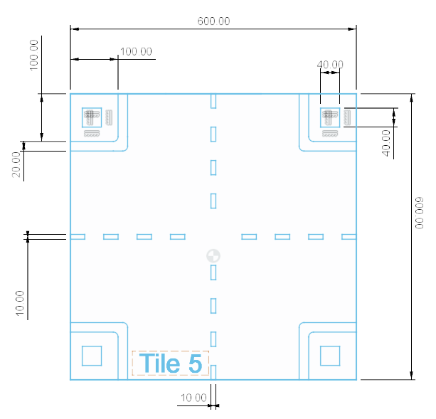

De verschillende tegels zullen tegen elkaar geplaatst worden en verbonden door de 
magnetische connectoren. 

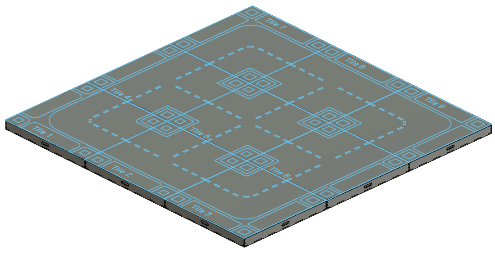

De magnetische connector zal voeding en een I²C verbinding doorgeven tussen de 
verschillende tegels. Aan alle zijde van de Expension Tiles zullen deze connectoren 
geplaatst worden. De Central Tile zal op drie van zijn zijde ook voorzien worden van 
deze connector. 

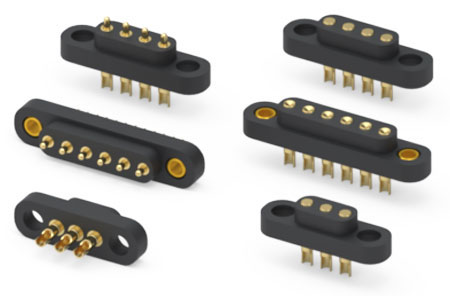

#### PCB
##### USB-C Power Delivery (PD)

Wanneer de USB-C connector wordt aangesloten op de PCB zal de USB controller 
bekijken hoeveel spanning en stroom het systeem nodig heeft en zal dit leveren. 

> elektrich schema

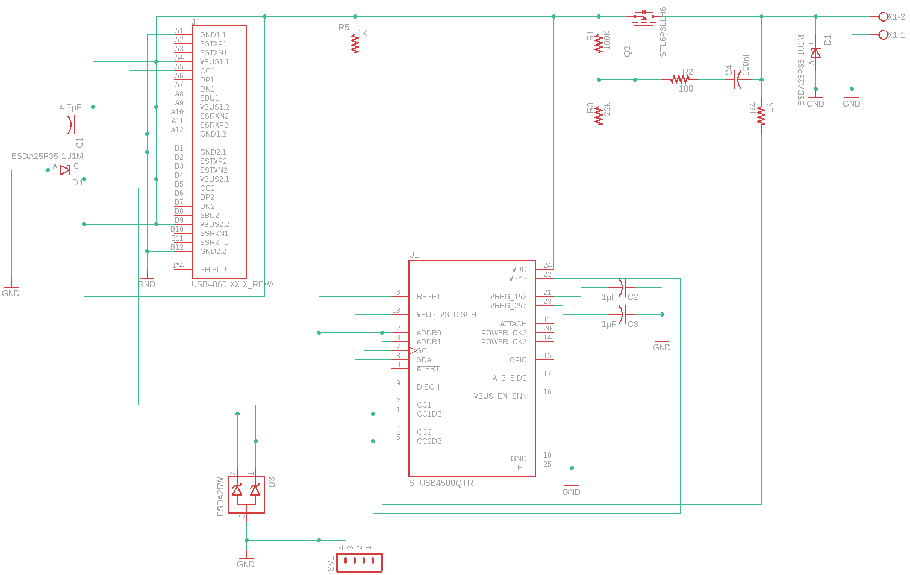

> PCB

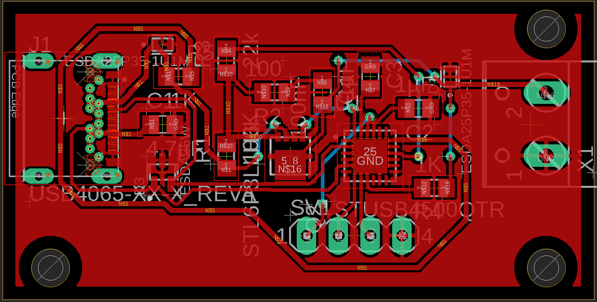

##### Smart Tile PCB

Elke tegel is voorzien van een PCB waar de microcontroller is in geplaatst. De PCB 
brengt alle GPIO pinnen van de microcontroller naar buiten, zo kunnen er makkelijk 
verschillende sensoren/ actuatoren op gemonteerd worden. 

> elektrich schema

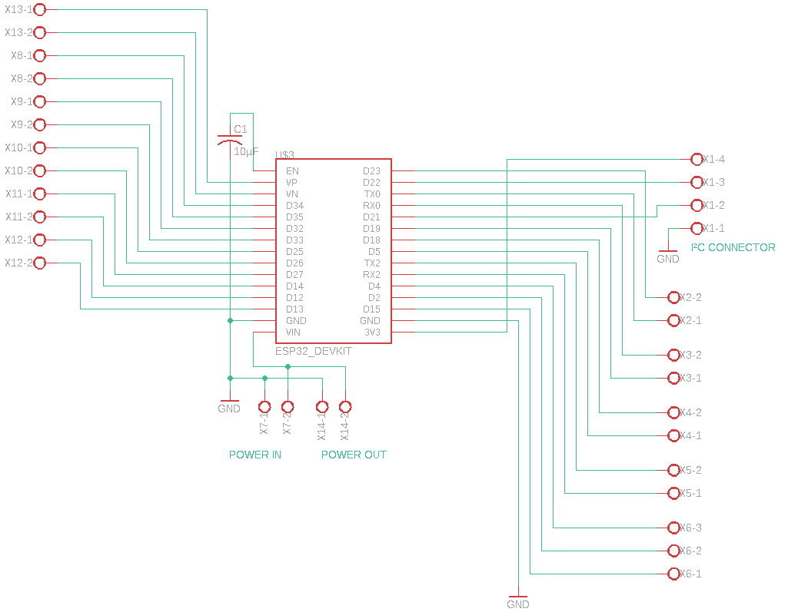

> PCB

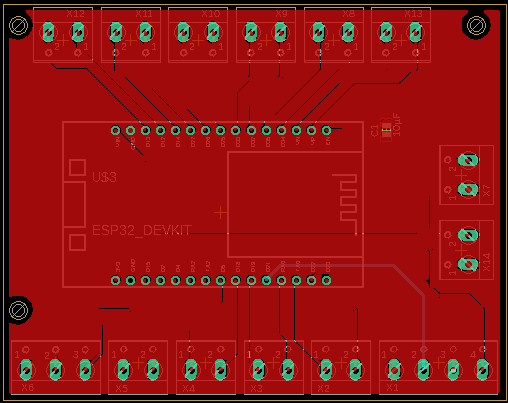

Voor beide PCB’s is er een Houder 3D geprint. Zo kunnen de PCB’s in de tegels 
gemonteerd worden.

### 3D componenten

> Smart Tile PCB Houder

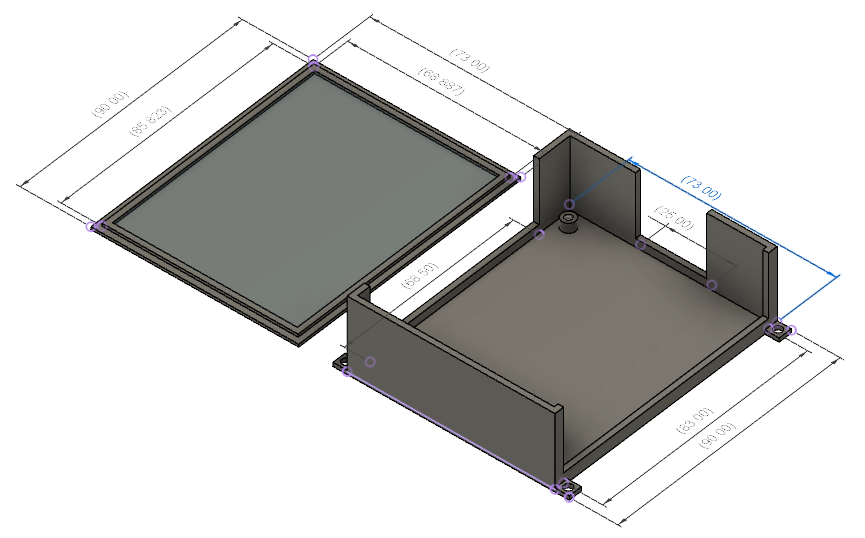

> USB-C PD PCB Houder

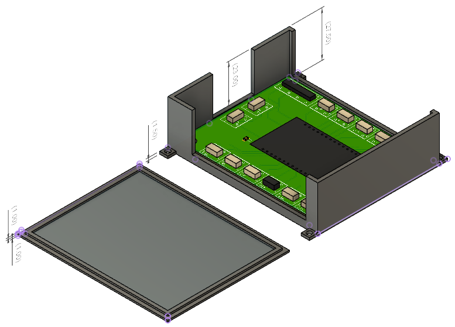

## Robot Platform

Het RobotPlatform is een robot wagen waar verschillende sensoren/ actuatoren op 
gemonteerd kunnen worden. Hierdoor kan er rond het Robotplatform verschillende 
labo’s ontworpen worden.

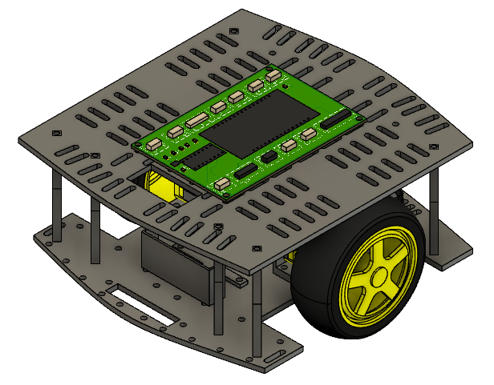

### Componenten
#### afmetingen

Het Robotplatform bestaat uit twee delen een motor laag en een sensor laag. Op de motor laag worden de motoren en de batterij gemonteerd. Op de sensor laag worden de sensoren/actuatoren gemonteerd,er kunnen verschillende sensor lagen op elkaar gemonteerd.

> Motor laag

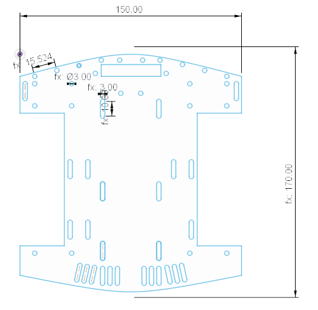

> Sensor laag

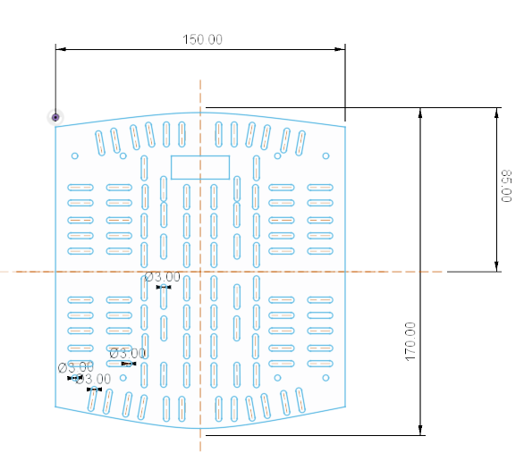

#### PCB

Het Robotplatform is voorzien van een PCB die zal instaan voor de motor sturing. De 
overige GPIO pinnen van de microcontroller worden naar buiten gebracht om 
verschillende sensoren en actuatoren op aan te sluiten. 
Het RobotPlatform wordt gevoed door een 7.5V batterij. Deze spanning is groter dan 
de nominale spanning van de microcontroller en verschillende sensoren/actuatoren. 
Om deze correct te voeden wordt de spanning gereguleerd met een spanningsregelaar 
naar de nominale spanning van de microcontroller. 
De H-brug wordt direct gevoed door de batterij omdat de nominale spanning van de 
motoren gelijk is met deze van de batterij. Om de snelheid van de motoren te regelen 
zijn vier PWM compatible GPIO pinnen verbonden met de PWM poorten van de H-brug.

> elektrich schema

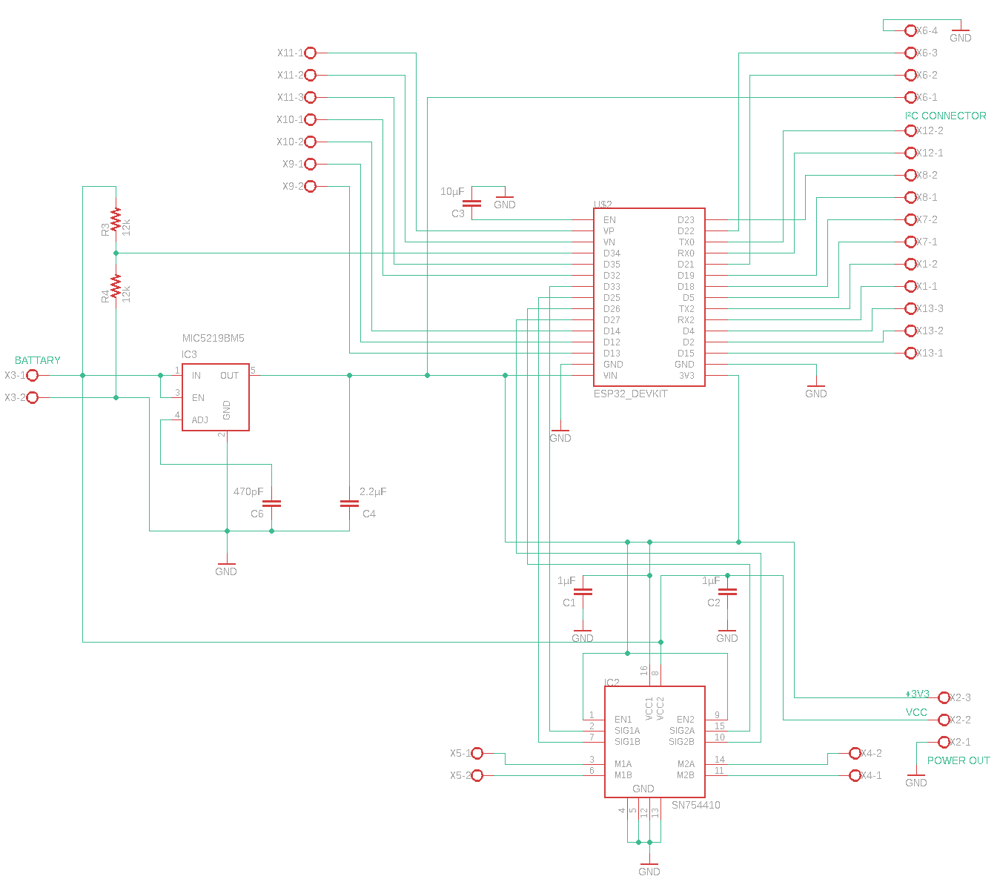

> PCB

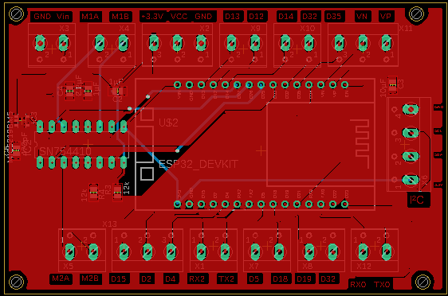

#### 3D componenten 

Om de motoren en de batterij op het RobotPlatform te monteren zijn er houders 3D 
Geprint. De batterij dat gebruikt wordt in het RobotPlaftorm is een Conrad energy liPO 20c 
(Conrad, sd). 

> batterij houder bovenaanzicht

> batterij houder zijaanzicht

De motoren die gebruikt worden binnen het Robotplatform Zijn Micro DC Worm Gear 
Motor with encoder (RobotShop, sd). 

> Motor houder bovenaanzicht

> Motor houder zijaanzicht

