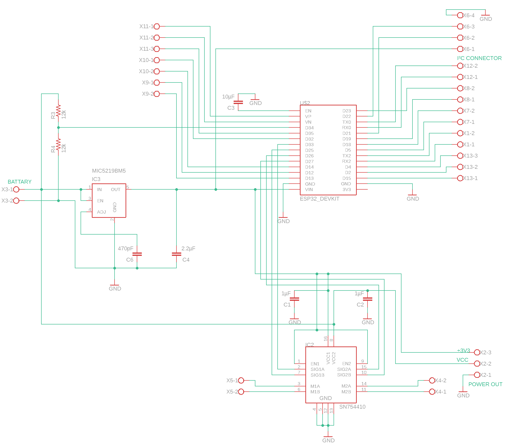
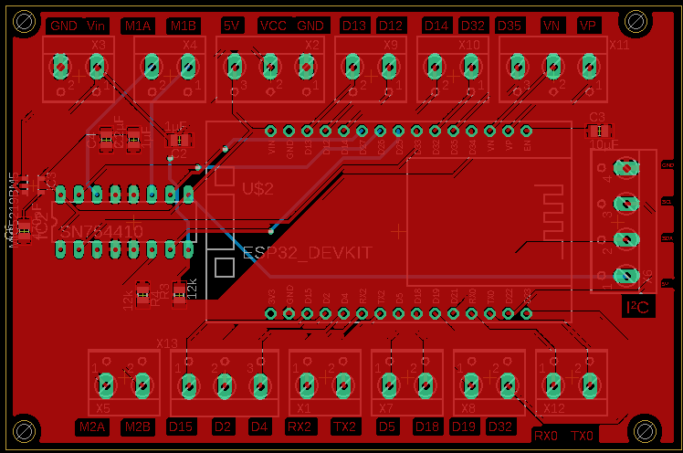

# Hardware Documentatie
## Robot Platform

### Componenten
#### afmetingen
+ Motor laag

+ Sensor laag

+ Motor houder bovenaanzicht

+ Motor houder zijaanzicht

+ batterij houder bovenaanzicht

+ batterij houder zijaanzicht

## PCB

+ elektrich schema

+ PCB

## Smart Tiles

### afmetingen

+ Smart Tile bovenaanzicht 1

+ Smart Tile bovenaanzicht 2

+ Smart Tile bovenaanzicht 3

