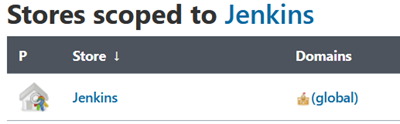

# Release Plan
___
## Hardware
### Netwerk
> Instellen of toegang krijgen toto een draadloos toegangspunt

    Om de microcontrollers binnen het remote labs te kunnen updaten vanuit het internet is toegang tot een wireless accespoint noodzakelijk.  Als er geen bestaand wirelless acesspoint voorhanden is dient er eentje opgezet te worden.

### Smart Tiles

> wifi-inloggegevens opslaan op de microcontroller

Alle in het labo gebruikte microcontrollers dienen voorzien te worden van wifi-inloggegevens.  Deze gegevens worden in het geheugen van de microcontroller aangebracht in de vorm van een “wifiConfig.ino” bestand en een “config.txt” bestand.

De inloggegevens worden opgeslagen in het SPIFF-geheugen van de microcontroller. Om het gebruik te kunnen maken van het SPIFF-geheugen moet de LittleFD bibliotheek geïnstalleerd worden. Onder het bibliotheek beheer in de Arduino IDE kun je de “LittleFS_esp32” bibliotheek instaleren.


Om de gegevens op te slaan moet er gebruik gemaakt worden van de “arduino-esp32fs-plugin” (Loro, 2021). Onder de release pagina van de reposetory kan je de plug-in downloaden. De plug-in moet geinstaleerd worden binnen de schetsboek locatie deze kun je vinden onder bestand -> voorkeuren en schetsboek locatie.


Binnen de schetsboek locatie moeten de volgende mappen aangemaakt worden.in de tool map worden alle bestanden afkomstig van de reposetory geplaatst.


In de “RemoteLabsArduinoTemplates” repesotory bevindt zich een data map. In de map bevindt zich het “config.txt” bestand, hier zullen de inloggegevens in geplaatst worden.
De inloggegevens moeten in het onderstaande formaat toegevoegd worden in het bestand.

    ```
    SSID,PASSWORD
    ```
Om de gegevens op de microcontroller te plaatsen druk je op data uploaden on der hulpbiddelen. 


Om te controleren of de gegevens correct zijn opgeslagen kan het “wifiConfig.ino” bestand op de microcontroller geprogrammeerd worden.


In de serieel monitor kan je controleren of de microcontroller verbonden is met het netwerk.


Als deze gegevens correct uitgelezen kunnen worden betekent dit dat ze in het geheugen zijn opgeslagen en bruikbaar zijn in eigen geschreven code.

> Microcontroller Template

Om de microcontroller te kunnen programmeren moeten studenten gebruik maken van een template. Het template kan gevonden worden in de ["RemoteLabsArduinoTemplates"](/img/ReleasePlan/WifiConfig_IP.png) reposetory.

Daarom moeten alle in het labo gebruikte microcontrollers voorzien worden van een template welke aangebracht kunnen worden via een fysieke seriële connectie.  Eens deze template succesvol is aangebracht kunnen studenten via het internet de microcontroller OTA-updaten. 

> Componenten aansluiten 

Als de microcontroller voorzien is van de wifi gegevens en de template kan deze in de PCB geplaatst worden.

De sensoren en actuatoren die gebruikt worden in het labo worden nu op de juiste tegels gemonteerd en aangesloten op de PCB’s van de gebruikte tegels.

> Smart Tiles aansluiten

Wanneer de individuele tegels geconfigureerd zijn kunnen alle tegels tegen elkaar geplaatst worden in de vorm die specifiek is voor het labo. De tegels worden met elkaar geconnecteerd via magnetische connectoren. Deze connectoren zullen voeding en een I²C verbinding aan elkaar doorgeven. De voeding zal aangesloten worden op de Central Tile. Deze zal de voeding doorgeven aan de andere tegels. 


Na het doorlopen van de bovenstaande stappen kunnen de Smart Tiles gebruikt worden binnen de RemoteLabs oplossing. 

### RemoteLabs
> Microcontroller Template

Om de microcontroller te kunnen programmeren moeten studenten gebruik maken van een template. Het template kan gevonden worden in de ["RemoteLabsArduinoTemplates"](/img/ReleasePlan/WifiConfig_IP.png) reposetory.

Daarom moeten alle in het labo gebruikte microcontrollers voorzien worden van een template welke aangebracht kunnen worden via een fysieke seriële connectie.  Eens deze template succesvol is aangebracht kunnen studenten via het internet de microcontroller OTA-updaten.

> Componenten aansluiten 

Als de microcontroller voorzien is van de wifi gegevens en de template kan deze in de PCB geplaatst worden.
    De sensoren en actuatoren die gebruikt worden in het labo worden nu op het robotplatform gemonteerd en verbonden met de PCB.
    
Het robot platform wordt gevoed door een 7.4V 2400mAh Conrad energy LiPo batterij. Voor dat we deze gaan aansluiten kunnen we controleren of deze niet leeg zijn door te meten of het voltage niet onder 6.2V bevindt. Wanneer de batterij van voldoende lading beschikt kan deze aangesloten worden. 

> Positioneren van het RobotPlatform

Binnen de RemoteLabs oplossing rijdt het RobotPlatform over de Smart Tiles. 
Het RobotPlatform moet op dezelfde plaats geplaats worden zoals deze wordt weergegeven in het labo. Hierdoor weten de studenten waar op de Smart Tiles het RobotPlatform zich bevindt. Met deze informatie weten de studenten in welke richtingen het RobotPlatform bediend moet worden. 
    
Na het doorlopen van de bovenstaande stappen kan Het Robotplatform gebruikt worden binnen de RemoteLabs oplossing. 

## Software
Alle technologieën die gebruikt worden in de RemoteLabs oplossing zijn gedeployed op een rasspberry pi.

### OTA Update
> Webserver instaleren

De webapplicatie zal deployed worden op een apache2 webserver. 
Open een terminal op de rasspberry pi en voer de volgende commano’s in.

    ```
    sudo apt update
    sudo apt install apache2 -y
    ```
Wanneer de productie versie van de webapplicatie wordt opgebouwd, wordt er een dist map aangemaakt. De inhoud van deze map zal gekopieerd naar de map waar apache naar kijkt. Het pad waar apache als default naar kijkt is “/var/www/html”.

> NodeJs Installeren

    Open een terminal van je rasspberry pi en voer de volgende commando’s in. 

    ```
    sudo apt-get install nodejs
    sudo apt-get install npm
    ```
    Als de installatie succesvol was kunnen de API en de Webapplicatie getest en gedeployed worden. 

> Msql installeren en instellen

In deze oplossing maken we gebruik van de MariaDB database. Deze kan geinstaleerd worden door het onderstaande commando in te geven in een terminal.

    ```
    sudo apt install mariadb-server
    ```
In de “RemoteLabsArduinoTemplates” repesotory vind je het sql bestand van de remote_labs databse. Met behulp van dit bestand kan de database geïmporteerd worden.

Voordat we dit bestand kunnen importeren moeten er enkele stappen doorlopen worden. Als eerst moet er een mysql gebruiker aangemaakt worden die toegang heeft tot de database.
    
```
    Mysql -u root -p
    CREATE USER 'newuser'@'localhost' IDENTIFIED BY 'password';
    GRANT ALL PRIVILEGES ON * . * TO 'newuser'@'localhost';
    FLUSH PRIVILEGES;
    Exit;
    ```

    Met de nieuwe gebruiker gaan we de database importeren. 
    ```
    Mysql -u 'newuser' -p
    CREATE DATABASE remote_labs;
    Exit;
    mysql -u 'newuser' -p remote_labs < remote_labs.sql
```
De database kan nu de nodige informatie opslaan en aangeven aan de API.

> Jenkins installeren en instellen 

Open een terminal van je rasppberry pi. Volg de volgende [stappen](https://pimylifeup.com/jenkins-raspberry-pi/) om Jenkins te installeren op je rasppberry pi.

> Credentials aanmaken

Om Jenkins toegang te geven tot je Github code moet je je inloggegevens toevoegen aan Jenkins. Om dit te doen moet je op de Jenkins dashboard naar de beheer Jenkins link navigeren.


Hier moet er genavigeerd worden naar “manage credentials” Dit vindt u terug onder security.


Onder “Stores scoped to Jenkins” klik je op jenkins.
    


Hier navigeer je naar de “global credentials”.


In het zijmenu kunt u nu nieuwe inloggegevens aanmaken.


Als Kind kies je “username with password” In de username en passwordtekstvlakken plaatsje de inloggegevens van je github account.

> Nieuwe pipline aanmaken

Op de Jenkins dashboard maak je een nieuw item aan.


Voeg de naam van het item in en kies als pipeline “Bouw een vrij style type software project” 


Bij het opbouwen van deze pipeline wordt gebruik gemaakt van git als broncode beheer. Voeg hier de GitHub repository URL in. Hier kiest u ook de GitHub credentials die hiervoor reeds is aangemaakt. 


De pipeline zal uitgevoerd worden wanneer deze een webhook ontvangt van GitHub. Deze webhook zullen we later opzetten.


Om de Webapplicatie en de API te deployen kies je voor “voer shell-script uit” en doorloop je onderstaande stappen.  Daarna kan je het item opslaan.

    ```
    cd RemoteLabsAPI
    npm install
    sudo pm2 stop all
    npm test
    sudo pm2 restart all

    cd ..
    cd RemoteLabsWebapp
    npm install
    npm test
    ng build --prod --base-href=/app/
    rm -r /var/www/html/
    cp -a /dist/. /var/www/html/
    ```
> GitHub Webhook aanmaken

Op GitHub navigeer je naar de “settings” pagina.


Op de “settings” pagina navigeer je naar de webhook pagina. Hier kan je een nieuwe webhook aanmaken.


De payload URL moet in een specifiek formaat worden opgesteld. 

    ```
    https://domeinNaam/jenkins/github-webhook/
    ```

Als content type kies je “application/json”. Wanneer je deze twee gegevens hebt ingevuld kan je de webhook opslaan.


Om te controleren of je de pipline en GitHub webhook correct hebt ingesteld kun je op de Jenkins dashboard op “start nu een bouwpoging” drukken op een build te triggeren. 


Wanneer nu de aangepaste code wordt gemerged met de master op github zal de pipline getriggerd worden. Dit zal de code testen en deployen.

### Labo Design Tools   
Om De RemoteLabs Labo’s te ontwerpen wordt gebruik gemaakt van Node-Red. Hiermee kan een Visuele interface worden opgebouwd waarlangs je kan communiceren met de microcontroller. Als communicatieprotocol tussen Node-Red en de microcontroller Is gekozen voor MQTT. We gaan beide technologieën deployen als een docker container. 

> Docker en Docker-compose installeren

Om Docker te installeren op de rasspberry pi kan je de volgende [tutorial](https://devdojo.com/bobbyiliev/how-to-install-docker-and-docker-compose-on-raspberry-pi)volgen.

> Mossquito installeren.

Open een terminal in je rasspberry pi en voer het volgende commando in. Hierna is mosquitto beschikbaar via het IP-adres van de rasspberry pi met de poort 1883.

    ```
    docker run -it --name mosquitto -p 1883:1883 eclipse-mosquitto
    ```
> Node-RED installeren. 

Voor de RemoteLabs oplossing wordt er voor elke labo groep een Node-RED instantie opgezet. Om dit te realiseren gaan we gebruikmaken van een Dockerfile en een Docker compose File.

Binnen de RemoteLabs oplossing worden enkele bestanden meegeleverd. In de map waar de Docker bestanden zich bevinden staat een flow Voor Node-Red die de studenten gaan gebruiken.

- Docker File
    ```
        FROM nodered/node-red
        RUN npm install node-red-dashboard node-red-contrib-ring-buffer
        COPY flows.json /data/flows.json
    ```
- Docker-compose
     ```
        version: "3.2"
        services:
        node-red:
            build: .
            ports:
            - 8880:1880
        node-red2:
            build: .
            ports:
            - 8881:1880
        node-red_n:
            build: .
            ports:
            - 8882:1880
    ```
Om beide bestanden te activeren moet je volgende commando’s uitvoeren.

    ```
    docker build -t RemoteLabs .
    docker-compose up -d
    ```
De Docenten kunnen de flow in de Node-Red Instantie aanpassen door te navigeren naar. Hier vind je de Node-RED flow editor.

    ```
    https://domeinNaam:8880
    ```
De studenten gaan gebruikmaken van de Node-RED dasboard om te kunnen communiceren met de Microcontroller. Het dashboard vindt u onder de Node-Red URL met /ui achteraan.

    ```
    https://domeinNaam:8880/ui
    ```
Wanneer beide containers draaien kunnen er verschillende labo’s ontworpen worden. De studenten zullen enkel toegang krijgen tot het dashboard van de Node-RED instantie.

### Reverse Proxy
Om via het internet in contact te komen met de services wordt er gebruik gemaakt van een reverse proxy.Met behulp van de reverse proxy kunnen de RemoteLabs oplossing gebruiken door maar één poort in het netwerk te meoten openen.

> Apache default poort aanpassen.

Omdat apache en de nginx beide als default poort 80 hebben moet de default van apache aangepast worden. Pas het volgende bestand aan.

    ```
    sudo nano /etc/apache2/ports.conf
    ```
In dit bestand passen we de poort aan.


> Prefix toevoegen aan Jenkins

Om toegang te krijgen tot Jenkins via de reverse proxy moet er een prefix aan de URL worden toegevoegd. Open het volgende bestand.
    
```
Sudo nano /etc/default/jenkins
```
 Voeg onderaan dit bestand het prefix toe aan de “Jenkins_ARGS “parameter.
    


Wanneer je deze preflix hebt toegevoegd kan je de URL toevoegen aan de reverse proxy.

> Nginx installeren

Nginx is de reverse proxy die we gaan gebruiken om alle services naar buiten bergen. Open een terminal en enter de volgende commando’s in.

    ```
    sudo apt-get install nginx
    sudo systemctl start nginx
    ```
> Domeinnaam

Om een stabiele toegang te krijgen tot de reverse-proxy moet je een dynamic dns toevoegen aan een domeinnaam. Dit domeinnaam wordt gebruikt in de reverse-proxy. Hier vind je een [tutorial](https://www.youtube.com/watch?v=EH8wJt81bqg) hoe je een dynamic dns kan opzetten met een domeinnaam.

> Portforward

Om vanaf het internet Toegang te krijgen tot de reverse proxy moet je op je router/modem poort 80 en poort 443 openzetten (portforwarden).

Voor elk merk van router/Modem is dit een ander proces, Daarom moet je de naam van je router met portforwarden opzoeken. Hiervoor zal je een tutorial vinden hoe dit moet voor jou specifieke router/modem

> HTTPS toevoegen aan Nginx

Om de connecties tussen het internet en de services te beveiligen wordt de connectie geëncrypteerd met het https-protocol. Om dit te realiseren wordt gebruik gemaakt van certbot om het SSL-certificaat aan te vragen.

Nadat certbot is geïnstalleerd wordt ook een plug-in geïnstalleerd die het certificaat automatisch zal toevoegen aan nginx.

    ```
    apt install certbot python3-certbot-nginx
    ```
Als certbot succesvol is geïnstalleerd kunnen we het certificaat opvragen voor het opgegeven domein.

    ```
    certbot --nginx -d domeinNaam
    ```
Hierbij zal gevraagd worden om een email adres in te geven. Dit dient om het certificaat te kunnen verifiëren. 
Als het certificaat is opgehaald krijg je de optie om het http-verkeer om te leiden naar https. Kies hier voor optie twee. 
Nu zullen alle services enkel beschikbaar zijn via https.

> Nigix instellen 
    
Open het volgende bestand.

    ```
    sudo nano /etc/nginx/sites-enabled/default
    ```
Verwijder de inhoud van dit bestand en vervang dit met de onderstaande tekst.

    ```
    server {
        server_name glhobelab.be;

        location /jenkins/ {
                proxy_pass http://127.0.0.1:9999;
        }

        location /app/ {
                proxy_pass http://127.0.0.1:9000/;
        }

        location /api/ {
                proxy_pass http://127.0.0.1:3000;
        }

        location / {
                proxy_pass http://127.0.0.1:1883;
        }


    listen [::]:443 ssl ipv6only=on; # managed by Certbot
    listen 443 ssl; # managed by Certbot
    ssl_certificate /etc/letsencrypt/live/glhobelab.be/fullchain.pem; # managed by Certbot
    ssl_certificate_key /etc/letsencrypt/live/glhobelab.be/privkey.pem; # managed by Certbot
    include /etc/letsencrypt/options-ssl-nginx.conf; # managed by Certbot
    ssl_dhparam /etc/letsencrypt/ssl-dhparams.pem; # managed by Certbot
    }

    server {
        if ($host = glhobelab.be) {
            return 301 https://$host$request_uri;
        } # managed by Certbot


            listen 80 default_server;
            listen [::]:80 default_server;

            server_name glhobelab.be;
            return 404; # managed by Certbot
    }
    ```
Als dit bestand is aangepast heb je nu toegang tot al de nodige services via de opgegeven domeinnaam.


