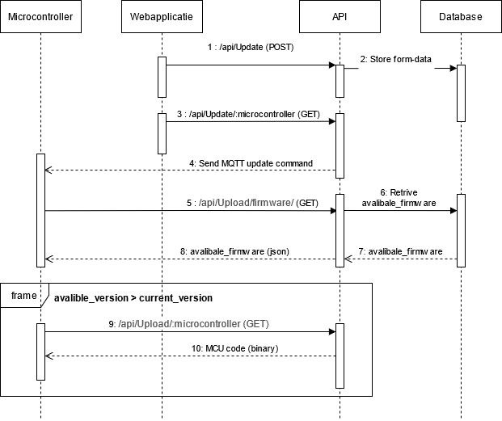
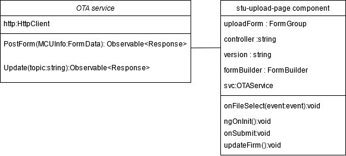
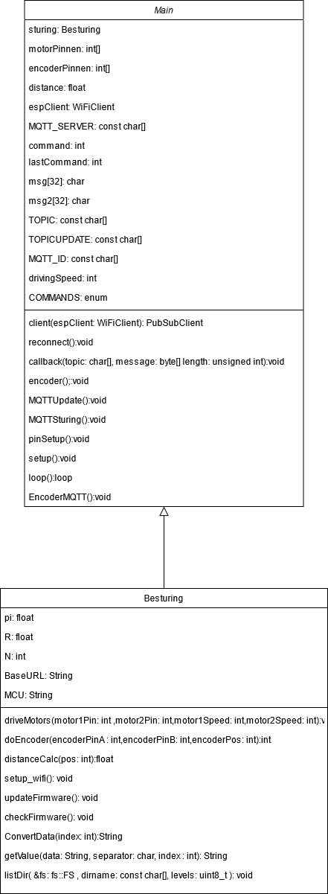
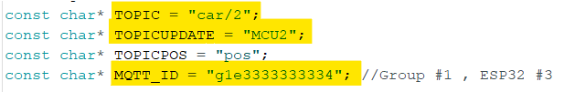
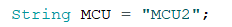
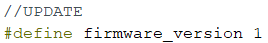
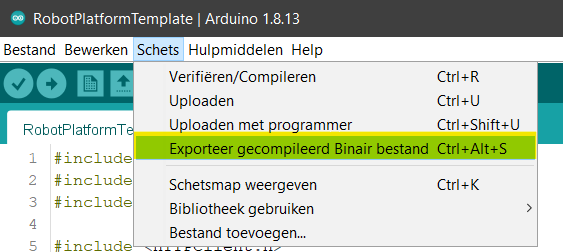
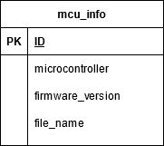

# Software Documentatie
___

In deze fase van de RemoteLabs oplossing Is de primaire functie van de software de 
studenten de mogelijkheid geven om een microcontroller via het internet te updaten. 



## webapplicatie

De webapplicatie is een MVP dat de studenten toelaat om hun code herhaaldelijk te 
uploaden op een microcontroller. De webapplicatie is opgebouwd met het Angular 
framework. 



## API

### API refrences 

| API-referentie-inhoud                |
|--------------------------------------|
| POST /api/Update/                    |
| GET /api/Update/:controller          |
| GET /api/Upload/:controller          |
| GET /api/Upload/File/:controller     |
| GET /api/Upload/Formware/:controller |

&nbsp;
___
## POST /api/Update/

met deze request ga je de de nodige informatie uploaden om de microcontroller OTA te updaten. Het verwachte inhoudstype voor de postgegevens is "multipart / form-data".

### Resource URL
```
https://domainName/api/Update/:controller
```
### Resource Information

|                  |                     |
|------------------|:-------------------:|
| Response formats |        JSON         |
| content-type     | multipart/form-data |
&nbsp;
### Parameters

| Name             | Required |                   Description                   | Default Value |  Example  |
|------------------|:--------:|:-----------------------------------------------:|:-------------:|:---------:|
| microcontroller  | required | kies de microcontroller die u niet wilt updaten |               |   MCU1    |
| firmware_version | required |           stel de nieuwe firmware in            |               |     1     |
| file             | required | het binaire bestand van uw microcontroller-code |               | Blink.bin |

Note : al de parameters moeten samen gevoegd worden in een form-data object.
&nbsp;
### Example Request
```
POST https://domainName/api/Update/MCU1
```
### Example Response
```
{
    "fieldCount": 0,
    "affectedRows": 1,
    "insertId": 0,
    "serverStatus": 34,
    "warningCount": 0,
    "message": "(Rows matched: 1  Changed: 1  Warnings: 0",
    "protocol41": true,
    "changedRows": 1
}
```
&nbsp;
___
## GET /api/Update/:controller
met deze request ga je een MQTT commando sturen die zal aangeven of de microcontroller geüpdatet moet worden of niet. 

### Resource URL
```
https://domainName/api/Update/:controller
```
### Resource Information

|                  |            |
|------------------|:----------:|
| Response formats | plain/text |
| content-type     | plain/text |
&nbsp;
### Parameters

| Name            | Required |                   Description                   | Default Value | Example |
|-----------------|:--------:|:-----------------------------------------------:|:-------------:|:-------:|
| microcontroller | required | kies de microcontroller die u niet wilt updaten |               |  MCU1   |


&nbsp;
### Example Request
```
GET https://domainName/api/Update/MCU1
```
### Example Response
```
command is send 
```
By error 

```
wrong topic or no connection with broker

```
&nbsp;
___
## GET /api/Upload/:controller
Deze request zal je de beschikbaar firmware versie opvragen. met deze request zal de microcontroller zijn nieuwe firmware versie ontvangen.

### Resource URL
```
https://domainName/api/upload/:controller
```
### Resource Information

|                  |                          |
|------------------|:------------------------:|
| Response formats |          binary          |
| content-type     | application/octet-stream |
&nbsp;
### Parameters

| Name            | Required |                   Description                   | Default Value | Example |
|-----------------|:--------:|:-----------------------------------------------:|:-------------:|:-------:|
| microcontroller | required | kies de microcontroller die u niet wilt updaten |               |  MCU1   |


&nbsp;
### Example Request
```
GET https://domainName/api/upload/MCU1
```
### Example Response
```
je code in een binaire vorm
```


&nbsp;
___
## GET /api/Upload/file/:controller
Met deze request vraag je de beschikbare bestand op voor de opgegeven controller. 

### Resource URL
```
https://domainName/api/upload/file/:controller
```
### Resource Information

|                  |            |
|------------------|:----------:|
| Response formats | plain/text |
| content-type     | plain/text |
&nbsp;
### Parameters

| Name            | Required |                   Description                   | Default Value | Example |
|-----------------|:--------:|:-----------------------------------------------:|:-------------:|:-------:|
| microcontroller | required | kies de microcontroller die u niet wilt updaten |               |  MCU1   |


&nbsp;
### Example Request
```
GET https://domainName/api/upload/file/MCU1
```
### Example Response
```
fileName.bin
```
no file
```
there is no new firmware file avalible for this controller
```


&nbsp;
___
## GET /api/Upload/firmware/:controller
Met deze request vraag je de beschikbare firmwareversie op voor de opgegeven controller. 

### Resource URL
```
https://domainName/api/upload/firmware/:controller
```
### Resource Information

|                  |      |
|------------------|:----:|
| Response formats | JSON |
| content-type     | JSON |
&nbsp;
### Parameters

| Name            | Required |                   Description                   | Default Value | Example |
|-----------------|:--------:|:-----------------------------------------------:|:-------------:|:-------:|
| microcontroller | required | kies de microcontroller die u niet wilt updaten |               |  MCU1   |


&nbsp;
### Example Request
```
GET https://domainName/api/upload/firmware/MCU1
```
### Example Response
```
[
    {
        "firmware_version": 1
    }
]
```
## Arduino 

via een template kan een studenten de firmware van een microcontroller updaten via het internet.Om een microcontroller herhaaldelijk te updaten moet er altijd gebruik gemaakt worden van het template.



## Dependencies 
Om gebruik te maken van het template, moet en de onderste dependencies toegevoegd worden aan de Arduino IDE.

* [analogWrite](https://www.arduino.cc/reference/en/language/functions/analog-io/analogwrite/)
* [PubSubClient](https://www.arduino.cc/reference/en/libraries/pubsubclient/)
* [HTTPClient](https://www.arduino.cc/reference/en/libraries/httpclient/)
* [WiFi](https://www.arduino.cc/en/Reference/WiFi)
* [WiFiMulti](https://github.com/espressif/arduino-esp32/tree/master/libraries/WiFi/src)
* [ESP32httpUpdate](https://www.arduino.cc/reference/en/libraries/esp32httpupdate/)
* [ArduinoJson](https://arduinojson.org/)
* [LITTLEFS](https://github.com/littlefs-project/littlefs)
* [WiFi](https://www.arduino.cc/en/Reference/WiFi)

## aanpasingen aanbrengen per microcontroller
Voordat het template correct gebruikt kan worden moeten er enkele aanpassingen aangebracht worden. Met deze aanpassingen wordt de microcontroller geidentificeerd.

+ .ino bestand



+ header bestand





## De code omzetten naar een binair bestand
Om de code te kunnen uploaden in de webapplicatie moet deze omgevormd worden naar een binair bestand.




## Database

Als database gebruiken we een MYSQL relationeel database. Hier wordt de data 
opgeslagen die de API nodig heeft om de juiste firmware naar de juiste microcontroller 
te sturen.

