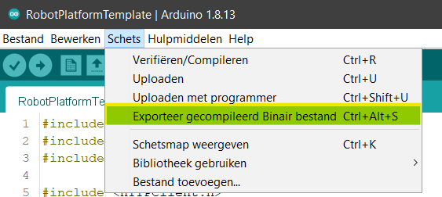

# Handleiding voor studenten
___

## Inleiding 

De remote labs oplossing geeft je de mogelijkheid om IoT labo's uit te voeren ongeacht je locatie. Met deze oplossing kun je verschillende microcontrollers programmeren via het internet.

## Opdracht uitvoeren

Zoals in een normaal labo zul je een opdracht ontvangen waarbij je een microcontroller zult programmeren. Het groot verschil met met een normaal labo is dat je een arduino code template ontvangt, het template moet **altijd** gebruikt worden om de microcontrollers correct via het internet te programmeren.

## Template aanpassen

Om de microcontroller correct te programeren moeten er enkele aanpassingen worden aangebracht. Met deze aanpassingen wordt de microcontroller geidentificeerd.

> main file


> hearder file


Bij elke versie van je code moet je een hogere versienummer ingeven.


## code omzetten

Wanneer je de code hebt gerschreven moet je deze omzetten naar een binair bestand.



Het binair bestand vind u in de zelfde locatie als je code.


Het binair bestand heeft nu een lange naam, dit zorgt voor problemen wanneer dit bestand 
geüpload moet worden.

om dit te voorkomen moet je het bestand hernoem naar een kortere naam.


## Binar bestand uploaden

Om de microcontroller via het internet te programmeren gaan we het binair bestand uploaden in de webapplicatie.

```
https://DomeinNaam/app/
```


Wanneer er op de "bladeren" knop wordt gedrukt opent de file manager, hier navigeer je naar de locatie van het binair bestand.
Hier kies je het binair bestand.


In de webapplicatie moet ook de huidige versie nummer worden ingegeven en naar welke microcontroller de code gestuurd moet worden.
Als al de gegevens zijn ingevoegd kan er op de submit knop worden gedrukt. Dit zal alle informatie opslaan.


Als alle gegevens correct zijn ingevoegd zal er een alert verschijnen met "submit". Wanneer de gegevens niet correct zijn ingegeven zal er een alert verscheinen met "bad request"


Wanneer de gegevens correct zijn geüpload kan er op de de "Update" knop worden gedrukt om de microcontroller te programmerenn.

## Node-Red

Om de sensoren/actuatoren te bedienen of uit te lezen maken we gebruik van het Node-Red dashboard.

```
https://DomeinNaam:8881-8889/ui
```
selecteer de de topic die opgegeven is in het labo.Hierna kun je de sensoren/actuatoren bedienen.


