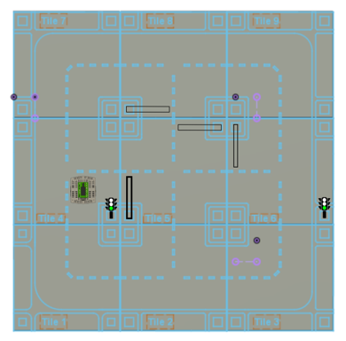

# Remote Labs Labo
___

## inhoud 

* Links
* Microcontrollers & Topics
* ESP32 info
* Node-Red / MQTT
* Robot Platform / Smart Tiles
* Template
* Microcontroller code
* Webapplicatie
* Opdracht
* Stappen voor Team 1
* Stappen voor Team 2

## Links

Webapp om je code te uploaden : 

https://glhobelab.be/app/

Node Red GUI:

https://glhobelab.be/node1

https://glhobelab.be/node2

https://glhobelab.be/node3

https://glhobelab.be/node4

https://glhobelab.be/node5

https://glhobelab.be/node6

## Microcontrollers & Topic

> Smart Tiles

* Smart Tile 1 = MCU1 = tile/1
* Smart Tile 2 = MCU2 = tile/2
* Smart Tile 3 = MCU3 = tile/3
* Smart Tile 4 = MCU4 = tile/4
* Smart Tile 5 = MCU5 = tile/5
* Smart Tile 6 = MCU6 = tile/6
* Smart Tile 7 = MCU7 = tile/7
* Smart Tile 8 = MCU8 = tile/8
* Smart Tile 9 = MCU9 = tile/9

> RobotPlatform

* Robot Platform 1 = MCU10 = car/1
* Robot Platform 2 = MCU11 = car/2
* Robot Platform 3 = MCU12 = car/3
* Robot Platform 4 = MCU13 = car/4
* Robot Platform 5 = MCU14 = car/5
* Robot Platform 6 = MCU15 = car/6
* Robot Platform 7 = MCU16 = car/7
* Robot Platform 8 = MCU17 = car/8
* Robot Platform 9 = MCU18 = car/9
* Robot Platform 10 = MCU19 = car/10

## ESP32 Info

## Node-RED

* Voor de besturing van de actuatoren en de sensoren gaan we gebruik maken van de Node-RED GUI. 

* De Node-RED GUI bediening zal  MQTT commando’s naar de microcontroller sturen. 

* Met deze MQTT commando’s moet er rekening gehouden worden in je microcontroller code. 

## Robot platform

* Het Robot platform heeft 2 motoren met elk een encoder
* Hiermee kun je bekijken hoe ver je al hebt gereden. 

## Smart Tiles

* De smart Tiles vormen samen een wegdek waar het robot platform kan over rijden.

* De smart Tiles bezitten slagbomen en verlichtingspalen die je gaat moeten programmeren.

## Template

* Om dit systeem correct te gebruiken moet je gebruikmaken van het meegegeven template!

* Om het template te gebruiken moet je enkele variabele aanpassen. In het .ino bestand, De TOPIC moet aangepast worden naar de Topic van je     groep. Verander de MQTT_ID naar een string naar keuze. 

* In de Template header file de MCU aanpassen naar de microcontroller die je moet programmeren. Je moet de firmware_version aanpassen naargelang het aantal versies dat je hebt geüpload op de microcontroller.

## Microcontroller code 

* Je code zal je in de webapp moeten uploaden als een binair bestand. 

* Dit doe je door in de Arduino IDE op **“shets” -> “Exporteer gecompileerd Binair bestand”** te drukken 

* Als de code correct gecompileerd is vind je het binair bestand in de zelfde map als je code. 

## Webapplicatie

* Eerst Upload je het binair bestand van je code. 

* Dan enter je de microcontroller die je wil programmeren. 

* Als laatste geef je de nieuwe firmware versie op.

* Druk op submit om alle opgegeve gegevens uploaden.

* Druk op Update om de microcontroller te updaten.

## Opdracht

* Voor dit labo worden jullie opgedeeld in 2 teams, alle bij de teams zullen een bepaald traject moeten doorlopen op de Smart Tiles met het Robot Platform.

* Deze opdracht is een race Het team dat als eerste zijn traject kan doorlopen wint.

* Je zal de nodige code moeten schrijven en uploaden via de webapplicatie. De sturingen zal je moeten uitoefenen aan de hand van een node-RED interface. 

* In slide 3 vind je de links naar de webapp en de juiste node red interface.

* Alle bij de Teams zorgen ervoor dat ze het robot platform een bepaalde afstand vooruit kunnen bewegen.

* Dit doe je met het behulp van de encoders op de motoren. Om de afstand te berekenen kun je gebruik maken van onderstaande formule

((2*pi*R)/N)*pos	

N = aantal stappen de Rotary encoder aflegt  per 360° = 1096 
R = de radius van een wiel  = 4.5 cm
Pos = het aantal stappen van de Rotary encoder 

### Team 1 : Stap 1

* Team 1 begint op het rechter rijvak van Tile 1 met de neus naar Tile 4.

* Zorg dat het verkeerslicht om de 10 sec van rood naar groen gaat en na nog eens 10 sec terug naar rood.

### Team 1 : Stap 2 & 3

<table>
  <tr>
    <td>Als het licht op groen staat rij dan 25cm vooruit</td>
     <td>Draai 90° naar rechts , draai het robotplatform zodat het op de zelfde plaats blijft staan.</td>
  </tr>
  <tr>
    <td></td>
    <td></td>
  </tr>
 </table>

### Team 1 : Stap 4 & 5

<table>
  <tr>
    <td>Rij 11cm vooruit.</td>
     <td>Zorg ervoor dat je de hefboom manueel omhoog of omlaag kan doen via Node-RED..</td>
  </tr>
  <tr>
    <td></td>
    <td></td>
  </tr>
 </table>

### Team 1 : Stap 6 & 7

<table>
  <tr>
    <td>Rij 105cm vooruit</td>
     <td>Draai 90° naar links , draai het robotplatform zodat het op de zelfde plaats blijft staan.</td>
  </tr>
  <tr>
    <td></td>
    <td></td>
  </tr>
 </table>

### Team 1 : Stap 8 & 9

<table>
  <tr>
    <td>Rij 84 cm vooruit.</td>
     <td>Rij nu 90° naar links , probeer het rijvak te volgen.</td>
  </tr>
  <tr>
    <td></td>
    <td></td>
  </tr>
 </table>

### Team 1 : Stap 10 & 11

<table>
  <tr>
    <td>Rij 66 cm vooruit.</td>
     <td>Draai 90° naar links , draai het robotplatform zodat het op de zelfde plaats blijft staan.</td>
  </tr>
  <tr>
    <td></td>
    <td></td>
  </tr>
 </table>

### Team 1 : Stap 12 & 13

<table>
  <tr>
    <td>Wacht nu op Team 2, als beide teams klaar staan open je de hefboom via node-Red.</td>
     <td>Rij nu 138 cm vooruit, Het team dat Tile 2 als eerst berijkt wint.</td>
  </tr>
  <tr>
    <td></td>
    <td></td>
  </tr>
 </table>

 ### Team 2 : Stap 1

* Team 2 begint op het rechter rijvak van Tile 3 met de neus naar Tile 6.

* Zorg dat het verkeerslicht om de 10 sec van rood naar groen gaat en na nog eens 10 sec terug naar rood.

### Team 2 : Stap 2 & 3

<table>
  <tr>
    <td>Als het licht op groen staat rij dan 47cm vooruit.</td>
     <td>Draai 90° naar links , draai het robotplatform zodat het op de zelfde plaats blijft staan.</td>
  </tr>
  <tr>
    <td></td>
    <td></td>
  </tr>
 </table>

### Team 2 : Stap 4 & 5

<table>
  <tr>
    <td>Rij 16cm vooruit.</td>
     <td>Zorg ervoor dat je de hefboom manueel omhoog of omlaag kan doen via Node-RED.</td>
  </tr>
  <tr>
    <td></td>
    <td></td>
  </tr>
 </table>

### Team 2 : Stap 6 & 7

<table>
  <tr>
    <td>Rij 120cm vooruit.</td>
     <td>Draai 90° naar rechts , draai het robotplatform zodat het op de zelfde plaats blijft staan.</td>
  </tr>
  <tr>
    <td></td>
    <td></td>
  </tr>
 </table>

### Team 2 : Stap 8 & 9

<table>
  <tr>
    <td>Rij 35cm vooruit.</td>
     <td>Rij nu 90° naar rechts , probeer het rijvak te volgen.</td>
  </tr>
  <tr>
    <td></td>
    <td></td>
  </tr>
 </table>

### Team 2 : Stap 10 & 11

<table>
  <tr>
    <td>Rij 38cm vooruit.</td>
     <td>Draai 90° naar rechts , draai het robotplatform zodat het op de zelfde plaats blijft staan.</td>
  </tr>
  <tr>
    <td></td>
    <td></td>
  </tr>
 </table>

### Team 2 : Stap 12 & 13

<table>
  <tr>
    <td>Wacht nu op Team 1, als beide teams klaar staan open je de hefboom via node-Red.</td>
     <td>Rij nu 138 cm vooruit, Het team dat Tile 2 als eerst berijkt wint.</td>
  </tr>
  <tr>
    <td></td>
    <td></td>
  </tr>
 </table>